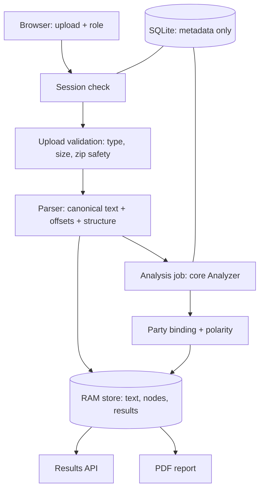

# Backend Architecture

The backend takes an uploaded contract, turns it into one canonical text with exact character offsets, runs the analysis core on that text, applies the user's side of the deal, and serves results to the frontend. It never generates legal text.

This file describes the target design. Sections marked **(planned)** do not exist yet. Update this file whenever the code changes shape.

---

## 1. Request flow



1. The browser creates an anonymous session and gets a bearer token (Phase 2).
2. It uploads one PDF or DOCX with the user's role and review scope.
3. The upload is validated by magic bytes, size and archive safety, then parsed in a worker thread.
4. The parser returns a `ParsedDocument`: canonical `source_text`, its SHA-256, text blocks with source locators, a structure tree and warnings. The uploaded bytes are dropped.
5. The analysis job passes `source_text` and an `AnalysisContext` to the core `Analyzer` from `ml/clauseanchor_core` and gets back category decisions with spans.
6. The backend applies polarity from the user's role and party binding. The core never sees the user's side.
7. Everything text-bearing lives in RAM with a 60-minute TTL. SQLite holds only metadata (ids, statuses, counts, offsets).

## 2. Key decisions

| Decision | Choice | Reason |
|---|---|---|
| PDF library | **pdfplumber** (MIT) | PyMuPDF is AGPL, which conflicts with the repo's MIT licence and the hosted demo |
| Offset unit | Unicode code points, `end` exclusive | Matches Python slicing; the frontend converts to UTF-16 |
| Canonical text | Built once, never changed after offsets are assigned | Every highlight, report line and rule flag points into the same string |
| Text normalisation | None in the parser (no dehyphenation, no NFKC, no ligature expansion) | Keeps `source_text` faithful to the file. Model-side normalisation belongs to the core, which maps its own offsets back |
| DOCX auto-numbering | Rendered as `StructureNode.label`, **not** inserted into `source_text` | `source_text` stays literal file text; the UI shows labels from nodes |
| Headers, footers, page numbers | Kept in `source_text`, marked as decoration ranges | Deleting them would shift offsets and hide content |
| Scanned or partly scanned PDFs | Rejected in v1 | A missing page must never become a false "not found" |
| Database | SQLite only, `create_all()` | Nothing durable is stored; no migrations tool needed |
| Worker model | One process, one bounded analysis worker, one executor thread | Fits a laptop and a free host; no Redis or Celery |
| User content storage | RAM only, 60-minute absolute TTL | Matches the synopsis promise; nothing on disk |

## 3. Folder structure

```text
backend/
  pyproject.toml            # package metadata, ruff and pytest config
  requirements.txt          # pinned runtime dependencies
  requirements-dev.txt      # pinned test and lint dependencies
  .env.example              # config names only, no secrets
  .gitignore                # .venv, caches, local db
  app/
    __init__.py
    parsing/                # Phase 1
      __init__.py           # public: parse_document, ParsedDocument, ParseError
      model.py              # dataclasses: ParsedDocument, Block, StructureNode, ParseWarning, Coverage
      assemble.py           # TextAssembler: builds source_text and assigns offsets while appending
      errors.py             # ParseError and the fixed error/warning code lists
      detect.py             # file type detection by magic bytes
      pdf.py                # pdfplumber extraction: words to lines to blocks, columns, decoration, scanned checks
      docx.py               # python-docx extraction: body order, tables, headers, footers, footnotes, numbering
      structure.py          # numbering stack, headings, schedules, definitions
      schema.py             # exports ParserContract JSON Schema
    scripts/
      parse_file.py         # CLI: parse a local file and print JSON (dev only)
    main.py                 # (planned, Phase 2) FastAPI app
    config.py               # (planned, Phase 2)
    db.py, models.py        # (planned, Phase 2) SQLite metadata
    schemas.py              # (planned, Phase 2) Pydantic DTOs
    api/routes.py           # (planned, Phase 2)
    services/               # (planned, Phase 2 and 3)
      memory_store.py       # RAM-only content with TTL
      sessions.py           # capability tokens
      jobs.py               # bounded queue, progress, cancel
      documents.py          # upload validation, parse jobs
      analysis.py           # core adapter and result validation
      polarity.py           # (Phase 3) party binding and polarity
      report.py             # (Phase 3) ReportLab report
    policies/polarity.yaml  # (planned, Phase 3) 46 category policies
  tests/
    conftest.py             # session-scoped fixture generation into a temp dir
    fixtures/build.py       # generates PDF and DOCX fixtures with reportlab and python-docx
    test_assemble.py
    test_pdf.py
    test_docx.py
    test_structure.py
    test_invariants.py      # offset invariant over every fixture
```

Fixtures are generated at test time, so no binary files are committed.

## 4. Parser output (summary; the full contract lives in ParserContract.md)

```python
@dataclass(frozen=True, slots=True)
class ParsedDocument:
    source_text: str
    text_sha256: str             # sha256 of source_text.encode("utf-8"), lowercase hex
    parser_version: str          # "1.0.0"
    media_type: str              # "application/pdf" or the DOCX mime type
    page_count: int | None       # None for DOCX
    blocks: tuple[Block, ...]    # every text block, in reading order
    nodes: tuple[StructureNode, ...]
    decorations: tuple[tuple[int, int], ...]   # repeated headers, footers, page numbers
    warnings: tuple[ParseWarning, ...]
    coverage: Coverage
```

Separators: lines inside a block join with `"\n"`, blocks join with `"\n"`, pages join with `"\n\n"`. Trailing spaces and tabs are stripped from each line before it is appended. CRLF and CR become LF. Nothing else changes.

## 5. Interface to the core (planned, Phase 2)

The backend imports only public names from `clauseanchor_core`: `CONTRACT_VERSION`, the result dataclasses, `Analyzer` and `StubAnalyzer`. It never imports training, extraction or retrieval internals. Contract version **2.0** (multi-span findings) must be present before the analysis part of Phase 2 starts. The switch is `CLAUSEANCHOR_ANALYZER=stub|real`; a real run with missing artifacts fails readiness instead of falling back to the stub.

## 6. Tech stack

Python 3.12, pdfplumber, python-docx, FastAPI, Pydantic v2, SQLAlchemy 2 on SQLite, ReportLab, PyYAML, pytest, httpx, ruff.
