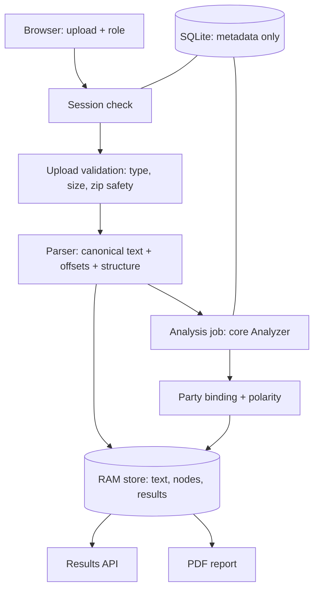

# Backend Architecture

The backend takes an uploaded contract, turns it into one canonical text with exact character offsets, runs the analysis core on that text, applies the user's side of the deal, and serves results to the frontend. It never generates legal text.

This file describes the target design. Sections marked **(planned)** do not exist yet. Update this file whenever the code changes shape.

---

## 1. Request flow



1. The browser creates an anonymous session and gets a bearer token (Phase 2).
2. It uploads one PDF or DOCX with the user's role and review scope.
3. The upload is validated by magic bytes, size and archive safety, then parsed in a child process that a wall-clock timer can kill (planned, Phase 2).
4. The parser returns a `ParsedDocument`: canonical `source_text`, its SHA-256, text blocks with source locators, a structure tree and warnings. The uploaded bytes are dropped.
5. The analysis job passes `source_text` and an `AnalysisContext` to the core `Analyzer` from `ml/clauseanchor_core` and gets back category decisions with spans.
6. The backend applies polarity from the user's role and party binding. The core never sees the user's side.
7. Everything text-bearing lives in RAM with a 60-minute TTL. SQLite holds only metadata (ids, statuses, counts, offsets).
8. Every capabilities response, analysis response and report carries the fixed scope notice (Phases.md, "Review scope"). After a complete analysis, the manual-review endpoint (planned, Phase 3) labels each display unit by its overlap with accepted findings, so text without findings is easy to reach.

## 2. Key decisions

| Decision | Choice | Reason |
|---|---|---|
| PDF library | **pdfplumber** (MIT) | PyMuPDF is AGPL, which conflicts with the repo's MIT licence and the hosted demo |
| Offset unit | Unicode code points, `end` exclusive | Matches Python slicing; the frontend converts to UTF-16 |
| Canonical text | Built once, never changed after offsets are assigned | Every highlight, report line and rule flag points into the same string |
| Text normalisation | No Unicode normalisation, dehyphenation or ligature expansion. Three extractor effects remain: PDF runs of spaces collapse to one space, PDF U+00A0 arrives as U+0020, and DOCX `w:noBreakHyphen` becomes ASCII `-` | Keeps `source_text` faithful to the file. Model-side normalisation belongs to the core, which maps its own offsets back. ParserContract.md lists the three effects |
| DOCX auto-numbering | Rendered as `StructureNode.label`, **not** inserted into `source_text` | `source_text` stays literal file text; the UI shows labels from nodes |
| Headers, footers, page numbers | Kept in `source_text`, marked as decoration ranges | Deleting them would shift offsets and hide content |
| Scanned or partly scanned PDFs | Count characters outside the margin zones. An image-dominant page with fewer than 20 is scanned. When every page with content is scanned, the file is rejected with `SCANNED_PDF`. When only some pages are scanned, the file parses with `coverage.partial = True` and a `PARTIALLY_SCANNED_PDF` warning. An image-dominant page with fewer than 200 also sets `coverage.partial = True`. Widget and FreeText annotations with content set `partial` too | Executed contracts often end in a scanned signature page, so rejecting them would turn away usable files. Margin text such as a Bates stamp does not make a scan readable. A searchable scan (full-page image, large real text layer) must stay usable. `partial` tells the core never to report "not found" for this file |
| PDF content budget | Page content streams and Form XObjects decode incrementally. Decoding aborts at 8 MiB (`MAX_DECODED_CONTENT_BYTES`) with `TOO_MUCH_TEXT` | A 16 KB file can decode to 16 MB and take minutes to extract, so the check must run while decoding. Only Flate streams are measured; the child-process kill (Worker model) covers the rest |
| DOCX tracked changes | `ins`, `del`, `moveFrom` and `moveTo` in any text part under `word/` are rejected with `TRACKED_CHANGES_PRESENT` | The parser cannot tell which version is the contract. The user accepts all changes and uploads again |
| DOCX text boxes | Every `w:txbxContent` outside `mc:Fallback` is extracted as text blocks right after its anchor paragraph. `TEXT_BOX_CONTENT` is an informational warning and `partial` stays False | Contract text can sit in a text box. Reading the Fallback copy as well would duplicate it |
| DOCX embedded objects | `EMBEDDED_OBJECT` warning and `coverage.partial = True` | The object's content is not extracted, so the core must not report "not found" for this file |
| DOCX unknown block content | The body walk recurses through `sdt`, `smartTag`, `fldSimple`, `customXml` and `hyperlink`. An unknown block-level child, including `altChunk`, is skipped with an `UNSUPPORTED_DOCX_FEATURE` warning and `coverage.partial = True` | Text inside a wrapper must not vanish. A raised error would leave no result to mark partial, so an unknown block is a warning |
| Database | SQLite only, `create_all()` | Nothing durable is stored; no migrations tool needed |
| Worker model | One API process, one bounded analysis worker, one executor thread. Each parse job runs in a child process with a wall-clock kill (planned, part 2-C) | Fits a laptop and a free host; no Redis or Celery. The kill stops a parse that the content budget cannot bound |
| User content storage | RAM only, 60-minute absolute TTL | Matches the synopsis promise; nothing on disk |
| Review scope | Fixed category catalogue, a fixed scope notice on every result, no safety score or overall verdict anywhere | The system checks listed categories only. A highlight-free passage is not a safe passage, and the output must never imply it is |
| Completeness | Processing completion, decision coverage and highlight extent are separate fields | Each answers a different question; merging them would read as "share of risk found", which nothing measures |
| Manual-review navigation | Derived in the backend from parser blocks and accepted spans; no new core field | Parser blocks are already exact, non-overlapping units, so the core interface (v2.0) stays unchanged |

## 3. Folder structure

```text
backend/
  pyproject.toml            # package metadata, ruff and pytest config
  requirements.txt          # pinned runtime dependencies
  requirements-dev.txt      # pinned test and lint dependencies
  .env.example              # config names only, no secrets
  .gitignore                # .venv, caches, local db, graphify-out
  app/
    __init__.py
    parsing/                # Phase 1
      __init__.py           # public: parse_document, ParsedDocument, ParseError
      model.py              # dataclasses: ParsedDocument, Block, StructureNode, ParseWarning, Coverage
      assemble.py           # TextAssembler: builds source_text and assigns offsets while appending
      errors.py             # ParseError, the fixed error/warning code lists and the limits
      detect.py             # file type detection by magic bytes
      pdf.py                # pdfplumber extraction: words to lines to blocks, columns, decoration, scanned checks, content budget
      docx.py               # python-docx extraction: body order, tables, text boxes, headers, footers, footnotes, numbering, tracked-change check
      structure.py          # numbering stack, headings, schedules, definitions
      schema.py             # exports ParserContract JSON Schema
    scripts/
      parse_file.py         # CLI: parse a local file and print JSON (dev only)
    main.py                 # (planned, Phase 2) FastAPI app
    config.py               # (planned, Phase 2)
    db.py, models.py        # (planned, Phase 2) SQLite metadata
    schemas.py              # (planned, Phase 2) Pydantic DTOs
    api/routes.py           # (planned, Phase 2)
    services/               # (planned, Phase 2 and 3)
      memory_store.py       # RAM-only content with TTL
      sessions.py           # capability tokens
      jobs.py               # bounded queue, progress, cancel
      documents.py          # upload validation, parse jobs (child process, wall-clock kill)
      analysis.py           # core adapter and result validation
      polarity.py           # (Phase 3) party binding and polarity
      report.py             # (Phase 3) ReportLab report
      review_units.py       # (Phase 3) manual-review display units and overlap labels
      scope.py              # (Phase 2) scope notice constant and category catalogue with support status
    policies/polarity.yaml  # (planned, Phase 3) 46 category policies
  tools/
    annotator/              # (planned, 2-0B) offline annotation tool: runs locally, no network
  tests/
    conftest.py             # session-scoped fixture generation into a temp dir
    fixtures/build.py       # generates PDF and DOCX fixtures with reportlab and python-docx
    test_assemble.py
    test_pdf.py
    test_docx.py
    test_structure.py
    test_invariants.py      # offset invariant over every fixture
```

Fixtures are generated at test time, so no binary files are committed.

## 4. Parser output (summary; the full contract lives in ParserContract.md)

```python
@dataclass(frozen=True, slots=True)
class ParsedDocument:
    source_text: str
    text_sha256: str             # sha256 of source_text.encode("utf-8"), lowercase hex
    parser_version: str          # "1.0.0"
    media_type: str              # "application/pdf" or the DOCX mime type
    page_count: int | None       # None for DOCX
    blocks: tuple[Block, ...]    # every text block, in reading order
    nodes: tuple[StructureNode, ...]
    decorations: tuple[tuple[int, int], ...]   # repeated headers, footers, page numbers
    warnings: tuple[ParseWarning, ...]
    coverage: Coverage
```

Separators: lines inside a block join with `"\n"`, blocks join with `"\n"`, pages join with `"\n\n"`. Trailing spaces and tabs are stripped from each line before it is appended. CRLF and CR become LF. In PDF text, runs of spaces collapse to one space and U+00A0 becomes U+0020. DOCX text keeps U+00A0.

## 5. Interface to the core (planned, Phase 2)

The backend imports only public names from `clauseanchor_core`: `CONTRACT_VERSION`, the result dataclasses, `Analyzer` and `StubAnalyzer`. It never imports training, extraction or retrieval internals. Contract version **2.0** (multi-span findings) must be present before the analysis part of Phase 2 starts. The switch is `CLAUSEANCHOR_ANALYZER=stub|real`; a real run with missing artifacts fails readiness instead of falling back to the stub.

## 6. Backend tech stack

Python 3.12, pdfplumber, python-docx, FastAPI, Pydantic v2, SQLAlchemy 2 on SQLite, ReportLab, PyYAML, pytest, httpx, ruff.

## 7. Frontend

A single-page app in `frontend/` that shows the contract as paper, marks findings in the margin and quotes judgments. It writes no legal text: every string on screen is quoted contract text, quoted judgment text or a short label (DesignSystem.md section 1).

Stack: React 19, Vite 8, Tailwind CSS v4, react-router 8, TypeScript (strict), pnpm. Node 22.18 or later (the tests rely on type stripping, which is on by default from 22.18) and pnpm 10 or later.

### 7.1 Data flow

1. `Start` is three steps, and the step lives in `?step=`. Step 1 creates a session, uploads a file (or a sample id in sample mode) and polls the parse job until the document is ready. Step 2 can open while parsing still runs. `lib/startFlow.ts` holds the state as a pure reducer and says which step it allows. `pages/start/useStartFlow.ts` holds the upload, the polling and the calls to `client`.
2. In step 2 the user picks a role and a party, or "None of these". Neither is preselected. Step 3 sets the scope. `Start` then sets the party binding, starts the analysis job and navigates to `/review/:documentId`.
3. `Reader` polls the job and fetches the analysis as categories resolve, then the manual-review list. It also handles re-binding the party, cancel, retry, report download and delete.
4. Every call goes through `client` in `src/api/client.ts`. Nothing else imports the mock. Today `client` is the in-memory mock adapter. The swap to an HTTP adapter is one line, planned for 4-C, and the adapter follows API.md.

### 7.2 Key decisions

| Decision | Choice | Reason |
|---|---|---|
| Data interface | `ApiClient` in `src/api/client.ts`, one exported `client` | The UI is built and reviewed before the API exists, and the swap touches one file |
| Type names | Kept as the mock defines them (`scope_notice`, `catalogue_version`, `processing_complete`, `decision_coverage`, `ReviewUnit`, `ManualReview`, `getManualReview`) | 2-E fixes the final names in API.md and the adapter follows it |
| Client state | React memory only: session token, contract text and job ids in `session.tsx`, theme in `theme.tsx`. Nothing in localStorage, sessionStorage, IndexedDB or cookies | Matches the promise that nothing is stored after the session |
| Offsets | `lib/offsets.ts` builds a code point to UTF-16 table once per text. Every slice of contract text goes through `sliceCp` | Backend offsets are code points and JavaScript strings index UTF-16 code units |
| Routing | `createHashRouter`: `/`, `/start`, `/review/:documentId`, `/how-it-works`, `/accuracy`, `/expired` and a catch-all that shows `NotFound`. Every page except `/` loads on demand. A failing page shows `RootError` inside the shell. `/gallery` is registered only in development, outside the shell | Works on any static host with no rewrite rules. The landing page does not carry the reader, and a bad address is not an expired session. A production build holds no gallery and no preview controls |
| Theming | Tokens are CSS custom properties in `src/index.css`, dark values under `.dark`. The first load follows `prefers-color-scheme` | One set of tokens for every component. DesignSystem.md lists them |
| Fonts | Source Serif 4, IBM Plex Sans and IBM Plex Mono, twelve files in `public/fonts/` (seven Latin and five Latin-extended), with `@font-face` rules, `unicode-range` and metric-matched fallbacks in `index.css` | No request leaves for a third party, which keeps the privacy promise. The rupee sign comes from the Latin-extended files, which the browser fetches only on a page that holds a character in that range (the landing page requests none). Other scripts fall back to a system font (`FrontendDesign.md` 17.2, S, and 17.3, X) |
| Motion and widths | Tokens in `index.css` (`--ease-out`, `--dur-*`, `--w-*`), one reduced-motion block, route changes through the View Transitions API | One set of values for every part. `DesignSystem.md` 3.5 lists them |
| Start flow | A pure reducer in `lib/startFlow.ts`, a hook for the side effects in `pages/start/useStartFlow.ts`, and the step in the address (`?step=`) | The rules are testable without a DOM. The address owns the step because a second copy in state raced on browser Back. Each upload carries a `seq`, so a late answer for a replaced file changes nothing (`FrontendDesign.md` 6.2 and 17.4, AD) |
| Tests | `node --test` over `src/**/*.test.ts`, with type stripping and no new dependency. 37 tests: 7 reveal, 8 colour tokens, 5 hero fixture, 17 start flow | The pure logic (`lib/reveal.ts`, `lib/offsets.ts`, `lib/startFlow.ts`, the hero fixture in `pages/landing/heroExamples.ts`) and the colour tokens are testable without a DOM. `tokens.test.ts` reads `index.css` and asserts the contrast pairs |

### 7.3 Folder structure

```text
frontend/
  package.json              # scripts: dev, build, preview, typecheck, test, format
  pnpm-lock.yaml
  tsconfig.json             # strict; the @ alias points to src
  vite.config.ts            # react(), tailwindcss(), the @ alias; Vite defaults (port 5173)
  index.html                # shell: lang, title, meta description, favicon, font preloads, noscript line
  .gitignore                # node_modules, dist, .vite, .screens
  public/
    favicon.svg             # the logomark, with a dark-mode variant
    fonts/                  # twelve woff2 files and the three OFL licence texts
  src/
    main.tsx                # mounts App
    App.tsx                 # ThemeProvider, SessionProvider, RouterProvider
    index.css               # fonts, design tokens (light, dark, motion, widths), global focus rule, layout and type classes, reveal, ink-in and hero keyframes, reduced-motion CSS
    tokens.test.ts          # asserts the contrast pairs of DesignSystem.md 3.1 against index.css
    api/
      client.ts             # ApiClient interface and the exported client (mock adapter today)
      types.ts              # API types; offsets are code points
      mock.ts               # in-memory adapter: sessions, job timeline, analysis
      contract.ts           # fictional sample agreement text for the mock
      catalogue.ts          # 46 categories with group, support status and catalogue version
    app/
      routes.tsx            # route table: lazy pages, error boundaries, dev-only /gallery
      Root.tsx              # shell: header, footer, toasts, skip link, focus on route change, dev-only preview controls
      RootError.tsx         # the page shown when a page fails to load or render
      session.tsx           # token, document metadata, toasts, mock settings (memory only)
      theme.tsx             # light and dark
    lib/
      offsets.ts            # code point to UTF-16 table and sliceCp
      useMedia.ts           # media query hook, reduced-motion hook
      reveal.ts             # scroll reveal core: pure, takes the observer as an argument
      reveal.test.ts
      useReveal.ts          # the hook around reveal.ts
      startFlow.ts          # the /start flow as a pure reducer, plus maxReachableStep, clampStep, nextBlocker, parseStep, suggestedParty
      startFlow.test.ts
    pages/
      Landing.tsx           # the landing page: hero, sections 1 to 6, closing call to action
      Start.tsx             # the three-step flow: upload, role and party, scope and start
      start/
        useStartFlow.ts     # upload, parse polling and the client calls, reporting to the reducer
        Summary.tsx         # what the user has chosen: the rail list from 1280 px, one line below
      landing/
        HeroDemo.tsx        # the live demo: excerpt, ruler, clause panel, "Next example"
        heroExamples.ts     # typed fixture: three findings from the sample contract, with code point offsets
        heroExamples.test.ts
        Evidence.tsx        # the Evidence section, rendered only when Landing.tsx holds a verified passage (D7)
      Reader.tsx            # three-pane reader: categories, document, clause detail
      HowItWorks.tsx
      Accuracy.tsx          # measured performance, labelled as an example until real numbers exist
      Expired.tsx
      NotFound.tsx          # the catch-all route
      Gallery.tsx           # component gallery, development only
    components/             # 50 components and icons.tsx: atoms (Button, StatusChip, ...),
                            # molecules (UploadDropzone, ConfidenceBand, JudgmentCard, ...),
                            # organisms (ClauseDetailPanel, CategorySidebar, ReaderToolbar, ...)
      Layout.tsx            # Container, Section, SectionFrame, MarginGrid
      Disclosure.tsx        # native details with a 44 px summary
      PreviewControls.tsx   # development only: mock switches and the gallery link
```

The FE parts change this tree. Each part updates this section. FE-2, FE-3 and FE-4 are built and are in the tree above. `FrontendDesign.md` holds the plan for FE-5 and FE-6.
